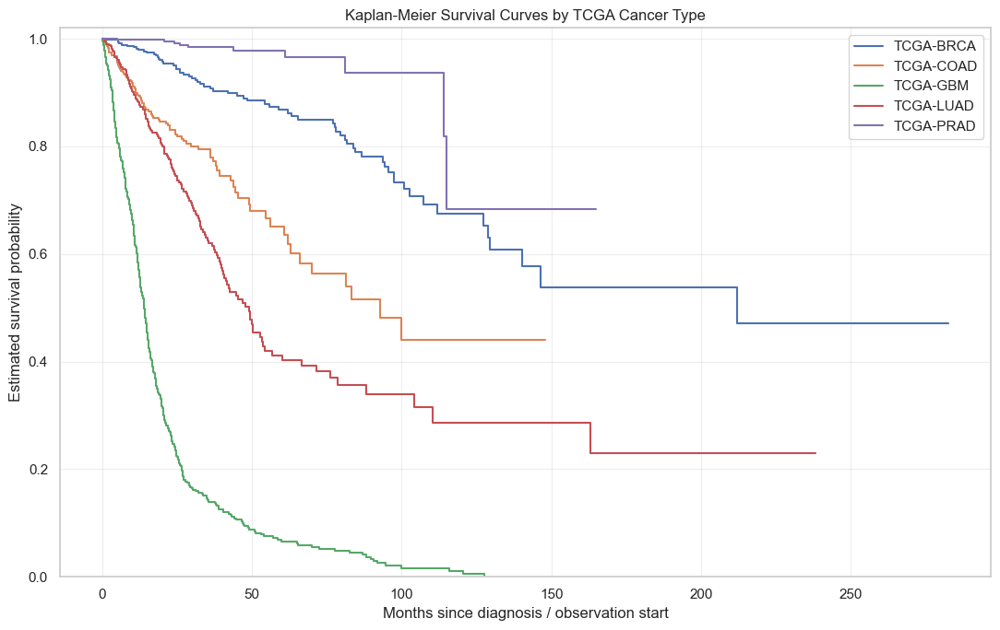
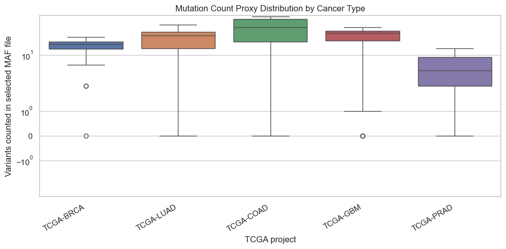
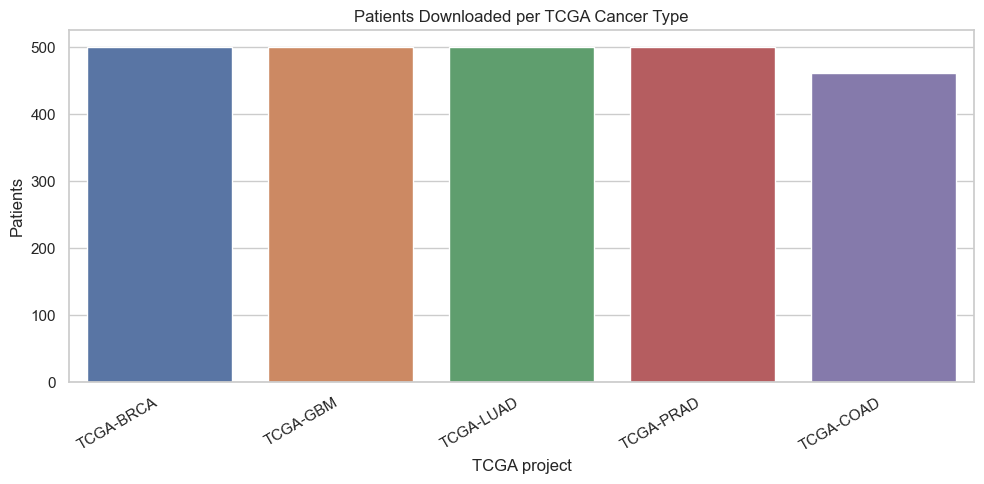
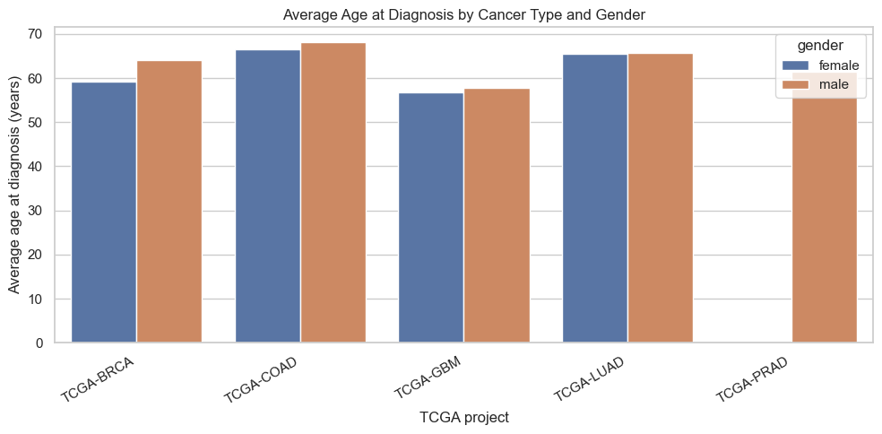
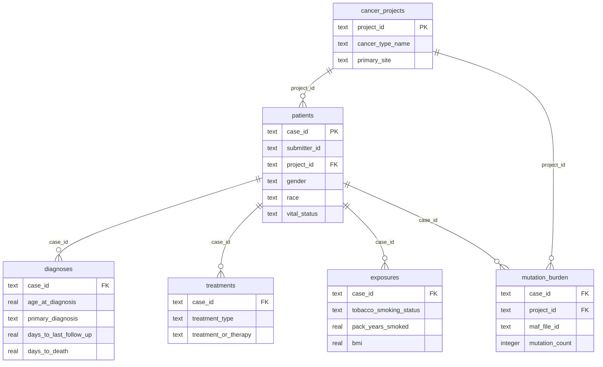

<picture>
  <source media="(prefers-color-scheme: dark)" srcset="assets/visual-abstract-dark.svg">
  
</picture>

<h1 align="center">Cancer Clinical Data Warehouse with TCGA, SQL and Python</h1>

<p align="center">
  Real patient data from the NIH Genomic Data Commons, modeled as a relational SQLite warehouse and analyzed with nine SQL queries and Kaplan-Meier survival curves
</p>

<p align="center">
  
  
  
  
  
</p>

<p align="center">
  <a href="#overview">Overview</a> &nbsp;·&nbsp; <a href="#results">Results</a> &nbsp;·&nbsp; <a href="#database-schema">Schema</a> &nbsp;·&nbsp; <a href="#sql-concepts-used">SQL concepts</a> &nbsp;·&nbsp; <a href="#how-to-run">How to run</a>
</p>

---

## At a glance

| **2,461** | **5** | **6** | **9** | **86% vs 2%** |
|:---:|:---:|:---:|:---:|:---:|
| patients | TCGA cancer types | relational tables | SQL analyses | observed deaths, GBM vs PRAD |

> **Take-home:** nested GDC records become a keyed relational warehouse, and nine SQL analyses compare survival, age at diagnosis and mutation burden across five cancers. Glioblastoma stands out, with 86.3% observed deaths and an average observation time of 17.5 months, compared with 2.0% in prostate cancer.

## Skills demonstrated

| Area | Evidence in this repository |
|---|---|
| **SQL** | Schema design with primary and foreign keys, joins, CTEs, CASE expressions, COALESCE, subqueries and ROW_NUMBER window functions |
| **Data engineering** | Paginated GDC REST API downloads with local caching, then flattening nested JSON into rectangular, keyed tables |
| **Clinical data analysis** | Demographics, survival summaries, mutation burden proxies from open MAF files and exposure records |
| **Survival analysis** | Kaplan-Meier curves per cancer type with lifelines, handling right-censored follow-up |
| **Python** | requests, pandas, NumPy, sqlite3, matplotlib and seaborn in a reproducible Jupyter notebook |

## Overview

This project builds a **miniature clinical data warehouse** from publicly available data in [The Cancer Genome Atlas (TCGA)](https://www.cancer.gov/tcga). A single notebook downloads real patient records from the **NIH Genomic Data Commons (GDC)** API, converts the nested JSON into relational tables, loads them into SQLite and then answers cohort questions with SQL. Consequently, the whole warehouse can be rebuilt from scratch with one run of `tcga_sql_warehouse.ipynb`.

| Project ID | Cancer type | Patients loaded |
|---|---|:---:|
| TCGA-BRCA | Breast invasive carcinoma | 500 |
| TCGA-LUAD | Lung adenocarcinoma | 500 |
| TCGA-GBM | Glioblastoma multiforme | 500 |
| TCGA-PRAD | Prostate adenocarcinoma | 500 |
| TCGA-COAD | Colon adenocarcinoma | 461 |

Clinical downloads are capped at 500 cases per project, and mutation burden is estimated from 50 open MAF files per project, so the notebook stays practical to run on a laptop.

## Results

### Survival differs sharply between cancer types

| Cancer type | Patients with survival data | Observed deaths | Observed death % | Average observation (months) |
|---|:---:|:---:|:---:|:---:|
| Glioblastoma (GBM) | 481 | 415 | 86.3% | 17.5 |
| Lung adenocarcinoma (LUAD) | 424 | 156 | 36.8% | 30.8 |
| Colon adenocarcinoma (COAD) | 437 | 95 | 21.7% | 28.6 |
| Breast carcinoma (BRCA) | 487 | 66 | 13.6% | 48.5 |
| Prostate adenocarcinoma (PRAD) | 500 | 10 | 2.0% | 35.9 |



Glioblastoma survival falls fastest, which matches its well-known aggressive course, whereas prostate cancer patients rarely reach an observed death within follow-up. Patients still alive at last follow-up are treated as censored, so they contribute information up to their last known time point.

### Mutation burden proxy

| Cancer type | MAF files | Average variants | Range |
|---|:---:|:---:|:---:|
| COAD | 50 | 41.4 | 0 to 72 |
| GBM | 50 | 26.7 | 0 to 41 |
| LUAD | 50 | 24.3 | 0 to 48 |
| BRCA | 50 | 15.9 | 0 to 25 |
| PRAD | 50 | 5.6 | 0 to 14 |



The proxy counts variant rows in one open masked somatic mutation file per patient. It is therefore a relative comparison between cancer types rather than a clinical tumor mutational burden.

### Cohort composition

<p>
  
  
</p>

### Data gaps the queries made visible

- **Tumor stage:** every patient falls into "Unknown / not reported", since the legacy `tumor_stage` field is no longer populated by the GDC API (newer AJCC staging fields would be needed).
- **Treatments:** the treatments endpoint returned no records for these five projects, so query 7 runs correctly but returns an empty table.
- **Smoking exposure:** only lung adenocarcinoma has recorded smoking status (current, reformed and lifelong non-smokers, with average pack-years of 29 to 48); the other four projects return "Unknown / not reported".

## Analyses and visualizations

1. **Patient count per cancer type** (bar chart)
2. **Average age at diagnosis by cancer type and gender** (grouped bar chart)
3. **Tumor stage distribution** (stacked bar chart)
4. **Observed death percentage per cancer type** (bar chart)
5. **Kaplan-Meier survival curves** (one curve per cancer type)
6. **Mutation burden proxy distribution** (box plot, log scale)
7. **Mutation burden versus observed survival** (multi-table JOIN analysis)
8. **Treatment patterns** (treatment type counts per cancer type)
9. **Tobacco smoking exposure trends** (grouped bar chart by project), plus a top-5 primary diagnosis ranking per project

## Database schema

The SQLite warehouse (`tcga_warehouse.db`) contains six relational tables connected by `case_id` and `project_id`:



| Table | Rows | Contents |
|---|:---:|---|
| `patients` | 2,461 | One row per case: project, gender, race, ethnicity, age, vital status |
| `diagnoses` | 3,531 | One row per diagnosis: age, primary diagnosis, follow-up and death times |
| `exposures` | 442 | Smoking status, pack-years, alcohol history and BMI |
| `treatments` | 0 | Treatment type and therapy (empty in this API response) |
| `mutation_burden` | 250 | Variant counts from one open MAF file per sampled patient |
| `cancer_projects` | 5 | Lookup table of project names and primary sites |

## SQL concepts used

| SQL concept | Where it is used |
|---|---|
| `CREATE TABLE` with primary and foreign keys | Database schema design |
| `INSERT INTO` / `to_sql()` | Loading cleaned DataFrames into SQLite |
| `SELECT`, `FROM`, `WHERE` | All 9 queries |
| `JOIN` / `LEFT JOIN` | Queries 1, 2, 6, 7, 8, 9 |
| `GROUP BY` + `ORDER BY` | All aggregation queries |
| `COUNT`, `AVG`, `MIN`, `MAX`, `SUM` | Demographic, survival and mutation queries |
| `CASE WHEN ... THEN ... ELSE ... END` | Stage normalization, smoking status labels |
| `COALESCE(a, b)` | Survival duration: prefer death date, fall back to last follow-up |
| Common table expressions (`WITH ... AS`) | Multi-step survival and mutation burden queries |
| `ROW_NUMBER() OVER (PARTITION BY ...)` | Top-5 diagnosis patterns per cancer type |
| Subqueries | Above-average age at diagnosis filter |

## How to run

```bash
pip install requests pandas numpy matplotlib seaborn lifelines jupyter
jupyter notebook tcga_sql_warehouse.ipynb
```

The first cell installs any missing packages, and API responses are cached in `tcga_api_cache/`, so later runs are faster. The notebook writes `tcga_warehouse.db` next to itself, which can then be opened in any SQLite client.

## Repository structure

```
├── tcga_sql_warehouse.ipynb   # Download, flatten, load, query and plot
├── assets/
│   ├── visual-abstract-*.svg  # Visual abstract (light and dark)
│   └── figures/               # Figures exported from the notebook outputs
└── LICENSE
```

## License

Released under the [MIT License](LICENSE). TCGA data are provided by the NCI Genomic Data Commons under its open-access data policy.
